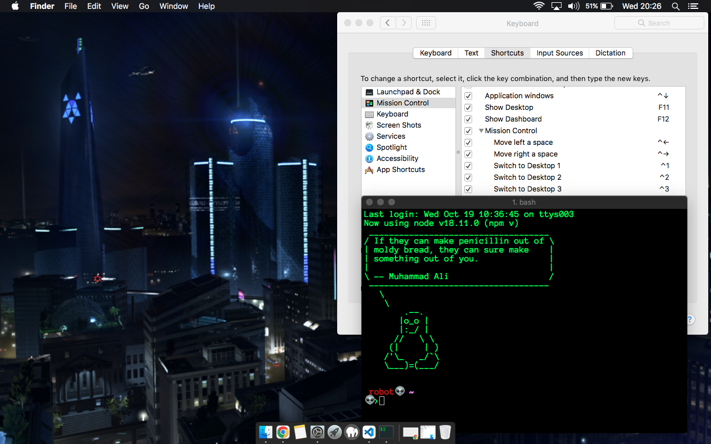

## My Mac Setup



- [What Macbook do I have?](#what-macbook-do-i-have)
- [Terminal Customization](#terminal--shell--homebrew)
  - [Homebrew](#homebrew)
  - [Terminal](#terminal)
  - [Shell](#shell)
    - [Install Bash and set it as the default](#install-bash-and-set-it-as-the-default)
    - [Customizing Bash with `.bash_profile`](#customizing-bash-with-bash_profile)
    - [Install the latest version of git](#install-the-latest-version-of-git)
    - [Other command line tools I use](#other-command-line-tools-i-use)
- [OS Productivity](#os-productivity)
  - [Window Management](#window-management)
  - [App Switching](#app-switching)
  - [Quick Launching](#quick-launching)
- [Other Apps I Use Daily](#other-apps-i-use-daily)
- [OS Settings](#os-settings)
  - [Finder](#finder)
  - [Dock](#dock)
- [Menu Bar Customization](#menu-bar-customization)
  - [System Stats Widgets](#system-stats-widgets)
  - [Menu Bar Calendar](#menu-bar-calendar)
- [Web Browser](#web-browser)
  - [Google Chrome](#chrome)
- [Node.js](#nodejs)
  - [Global Modules](#global-modules)
- [VS Code](#vs-code)

<!--  -->

## What Macbook do I have?

I am still using the 13-inch, Early 2011 Macbook Pro (yes still in 2022). This 12 year old laptop still runs great for all of my needs (design, development, image editing and video editing).

These are the specs at a glance:

* Intel "Core i5" Quad Core 2.3 GHz
* 10GB RAM DDR3
* 1TB HDD
* Intel HD Graphics 3000 512 MB

Note 👉 I Upgraded the Storage and Memory. You can read more about it specs and features [here](https://support.apple.com/kb/sp619?locale=en_GB)

🖥 - The apps and settings I use will work on all later versions including the latest M1 and M2 MacBooks as well.

## terminal--shell--homebrew

### Homebrew

[Homebrew](https://brew.sh/) Is the missing package manager for allows us to install tools and apps from the command line.

To install it, open up the built in `Terminal` app and run this command:

```sh
/bin/bash -c "$(curl -fsSL https://raw.githubusercontent.com/Homebrew/install/HEAD/install.sh)"
```

This will also install the xcode build tools which is needed by many other developer tools.

After Homebrew is done installing, we will use it to install everything else we need.

### Terminal

The first app I install is to replace the built in `Terminal`.

I prefer [iTerm2](https://iterm2.com/) because:
* Lots of customization options
* Clickable links
* Native OS notifications

There are a lot of options for replacing the default Mac Terminal, but I've been using iTerm2 for 8 months and it works great for my needs.

We install this using a Homebrew "cask". Casks are full applications, similar to what you would install from the App store.

```
brew install iterm2
```

Once installed, launch it and customize the settings / preferences to your liking. These are my preferred settings:

* Appearance
  * Theme
    * Minimal
* Profiles
  * Default
      * General -> Working Directory -> Reuse previous session's directory
      * Colors -> Basic Colors -> Foreground -> Lime Green
      * Text -> Font -> Anonymous Pro
          * You can download this font [here](https://www.marksimonson.com/fonts/view/anonymous-pro).
          * I use this font in VS Code as well
      * Text -> Font Size -> 16
          * I prefer small font sizes unless I'm presenting or sharing my workspace
      * Keys -> Key Mappings -> Presets -> Natural Text Editing
          * This allows me to use the [keyboard shortcuts](https://gist.github.com/w3cj/022081eda22081b82c52) I know and love inside of iTerm2

### Shell

Mac now comes with `zsh` as the default [shell](https://en.wikipedia.org/wiki/Comparison_of_command_shells). `ba
